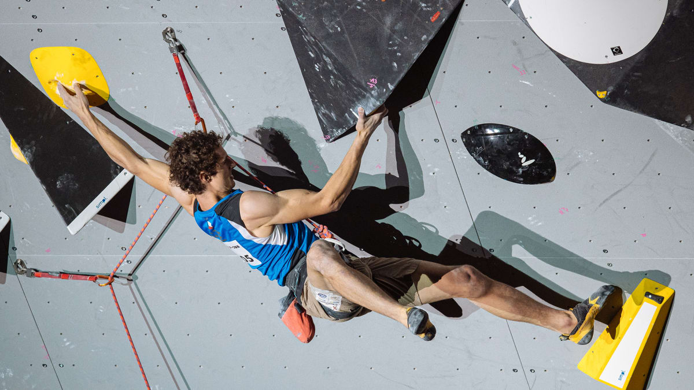

# DSA 210 Term Project: Climbing Performance Analysis

<h3 align="center">From Crag to Competition: Does Outdoor Sport Climbing Translate to Competitive Success?</h3>

<div align="center">
    
</div>

## Motivation

Climbing is a rapidly growing sport, with distinct communities in outdoor sport climbing and indoor competitive climbing (e.g., bouldering and lead climbing). As a climber myself and an avid follower of International Federation of Sport Climbing (IFSC) competitions, I've often wondered how performance in outdoor sport climbing correlates with success in formal competitions, such as those organized by IFSC. This project aims to explore whether skills and achievements in outdoor sport climbing, as logged by climbers on platforms like 8a.nu, translate to competitive performance in IFSC boulder and lead climbing events.

[🚀 Check out the project website](https://ssinix.github.io/crag-to-competition/)

## Data Collection

### IFSC Competition Data
Scraped [IFSC athlete rankings page](https://www.ifsc-climbing.org/rankings/index) using Python (`requests`, `BeautifulSoup`) collecting climber names, countries, gender, and points across boulder, lead, and combined disciplines.

### 8a.nu Profile Data
Used **Selenium** and **fuzzy string matching** to find and scrape IFSC climbers' outdoor climbing profiles on [8a.nu](https://www.8a.nu/), extracting:
- Highest grade climbed (converted to linear scale)
- Count of 8c+ ascents
- Average grade of first 5 unique ascents

Final dataset: **551 climbers** with both competition and outdoor climbing metrics.

## Analysis Process

### Exploratory Data Analysis
- Analyzed distributions and correlations between outdoor and competition metrics
- Segmented data by discipline due to varying athlete participation
- Examined performance patterns by region and gender
- Created visualizations (scatter plots, heatmaps, pairplots) to identify relationships

### Hypothesis Testing
Conducted statistical tests across five key hypotheses:

1. **8c+ Benchmark vs Competition Performance**: Two-sample t-tests showed climbers with 8c+ ascents significantly outperform others across all disciplines, with strongest effects in lead and combined formats.

2. **Highest Outdoor Grade vs Competition Performance**: Pearson correlation tests revealed statistically significant moderate positive correlations for bouldering and combined, but no significant correlation for lead climbing.

3. **Average Outdoor Grade vs Competition Performance**: Significant but modest correlations found across all disciplines, with strongest relationship in bouldering.

4. **Inter-discipline Competition Correlations**: Strong correlations between all IFSC disciplines, indicating overlapping skillsets.

5. **Outdoor Metrics Correlations**: Strong correlation between highest grade and average grade, showing consistency in outdoor performance.

## Machine Learning
Built predictive models for competition performance using Linear Regression and XGBoost:

- **Baseline RMSE**: 879.60 (mean guess)
- **Linear Regression**: ~450 RMSE (7% of target range)
- **XGBoost**: 297.63 RMSE with 10-fold CV (4.6% of target range)

XGBoost significantly outperformed linear regression across all validation methods.

## Setup and Installation

### Prerequisites
- Python: Version 3.8 or higher
- Dependencies: Listed in requirements.txt
### Setup

1. Clone the repository:
```bash
git clone <https://github.com/ssinix/crag-to-competition>
```

2. Install dependencies:

```bash
pip install -r requirements.txt
```

### Running the Project
The analysis is organized in numbered Jupyter notebooks designed to be run sequentially. The final dataset is provided, so scraping is optional.

Launch Jupyter Notebook:
```bash
jupyter notebook
```
**Note**: Web scraping may require ChromeDriver for Selenium and results may vary due to website changes.

## Limitations and Future Work

- **Small dataset**: 551 climbers limits analysis and model robustness
- **Limited IFSC features**: Could scrape additional athlete data (age, experience, competition history) from individual athlete pages
  - IFSC athlete profile URLs require unique IDs not easily derivable from rankings
- **Ranking vs. points**: Average ranking might be more meaningful than total points, which depends on the number of competitions
- **Outdoor scope**: Analysis limited to sport climbing; 8a.nu scraping could include outdoor bouldering data

