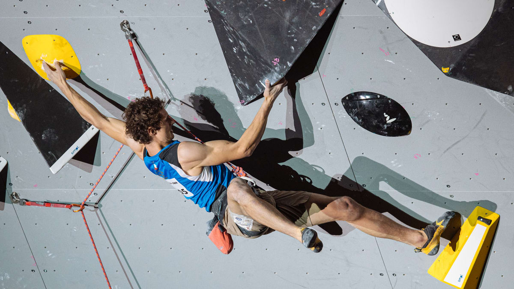

# DSA 210 Term Project Proposal: Climbing Performance Analysis

<h3 align="center"> From Crag to Competition: Does Outdoor Sport Climbing Translate to Competitive Success?</h3>

    

## Motivation
Climbing is a rapidly growing sport, with distinct communities in outdoor sport climbing and indoor competitive climbing (e.g., bouldering and lead climbing). As a climber myself and an avid follower of International Federation of Sport Climbing (IFSC) competitions, I've often wondered how performance in outdoor sport climbing correlates with success in formal competitions, such as those organized by IFSC. This project aims to explore whether skills and achievements in outdoor sport climbing, as logged by climbers on platforms like 8a.nu, translate to competitive performance in IFSC boulder and lead climbing events. Understanding this relationship could provide insights into training strategies, climber versatility, and the evolution of climbing as both a recreational and competitive sport.

## Data Sources
1. **IFSC Competition Data**
   * https://www.ifsc-climbing.org/
   * Official records from the IFSC, including climber names, countries, total points, years active, competition history, and rankings in boulder and lead events.
   * Focus on major events (World Cups, Championships) from 2020–2024, targeting data for 100–200 unique competitors.

3. **Outdoor Climbing Profiles (8a.nu & The Crag)**
   * https://www.8a.nu/
   * https://www.thecrag.com/en/home
   * User-generated data from 8a.nu and The Crag, featuring climber profiles and ascent logs (e.g., route grades, dates, ascent types like onsight or redpoint).
   * Aiming to match approximately 50 IFSC climbers with accounts on these platforms, focusing on active users with detailed ascent histories.

## Data Collection Plan
1. **IFSC Scraping**
   * **Method**: Use Python with requests and BeautifulSoup to extract competition results from the IFSC website.
   * **Scope**: Collect data from recent IFSC seasons, emphasizing boulder and lead disciplines.
   * **Challenges**: Name standardization across sources (e.g., "John Doe" vs. "J. Doe") will require careful cleaning.

2. **8a.nu & The Crag Scraping**
   * **Method**: Automate searches on 8a.nu and The Crag using IFSC climber names, employing Python scripts (potentially with selenium for dynamic pages) to scrape matching profiles and ascent data.
   * **Scope**: Target profiles of IFSC climbers, expecting overlap primarily among younger competitors active on these platforms.
   * **Challenges**: Limited overlap due to generational shifts in platform usage; manual verification may be needed for ambiguous matches.

3. **Data Enrichment and Linking**
   * **Approach**: Merge IFSC and outdoor datasets by matching climber names and other identifiers (e.g., nationality), using pandas for data handling and fuzzywuzzy for fuzzy name matching.
   * **Output**: A unified dataset with columns such as climber ID, outdoor ascent grades, competition rankings, and participation frequency.

## Hypothesis
The primary hypothesis is: *"Climbers with higher outdoor sport climbing grades (e.g., 8a or above) exhibit stronger performance in IFSC boulder and lead competitions."* This will be tested by comparing outdoor climbing difficulty (e.g., route grades) with competition metrics (e.g., rankings, qualification success rates).
