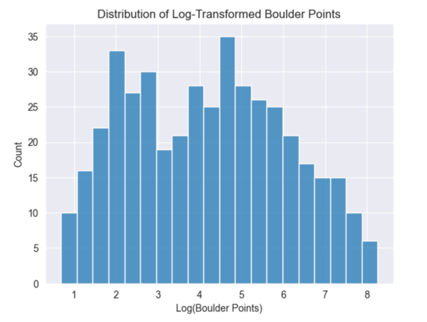
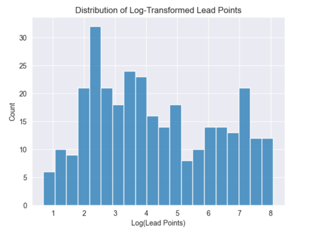
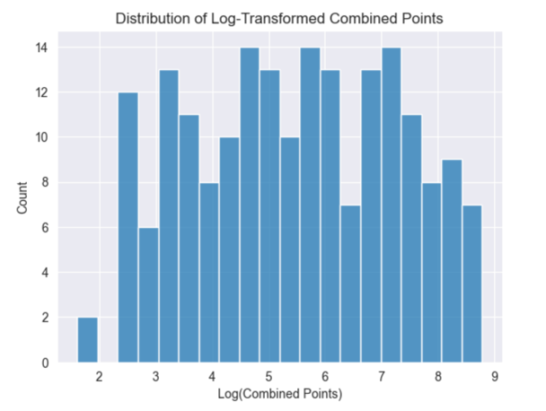
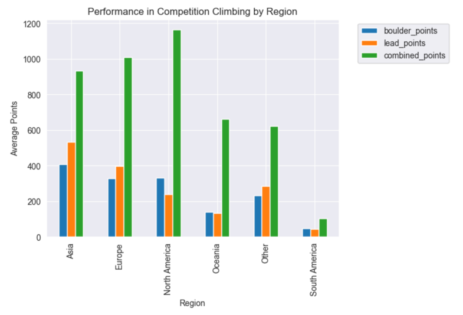
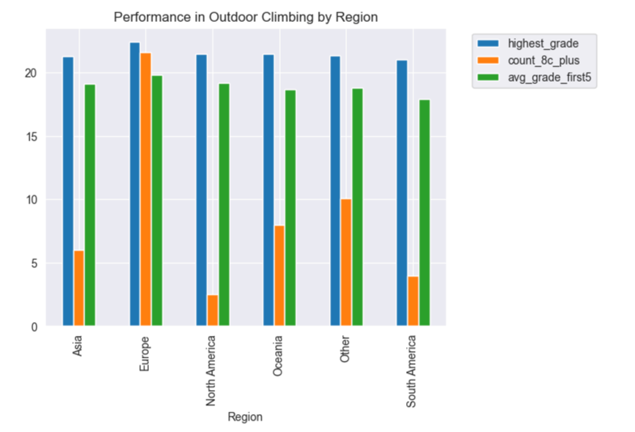
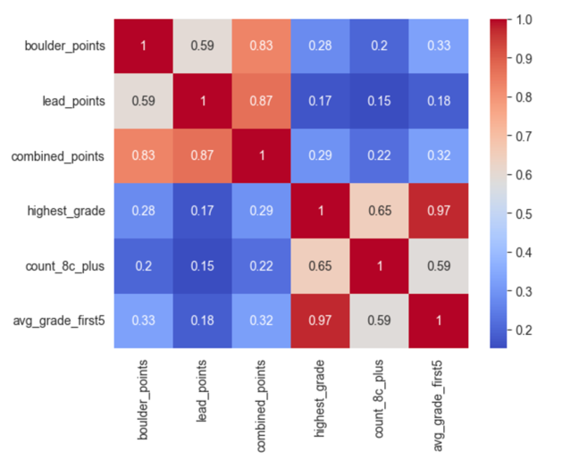
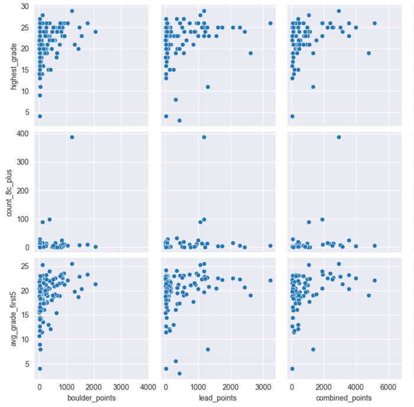
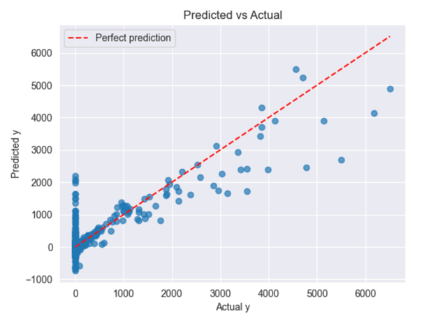
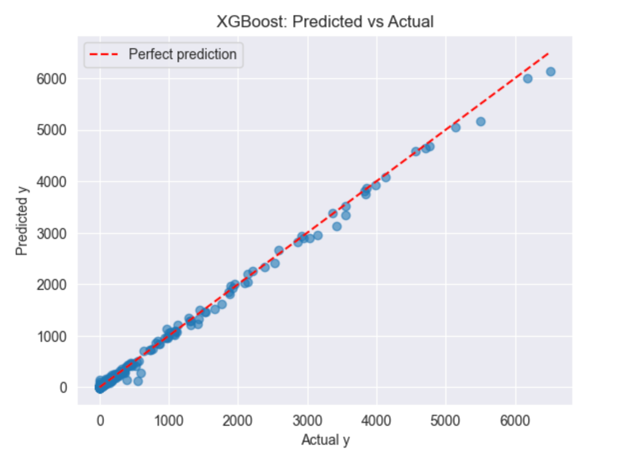

<link rel="stylesheet" type="text/css" href="style.css" />

# Does Outdoor Sport Climbing Translate to Competitive Success?

## Motivation

Climbing is a rapidly growing sport, with distinct communities in outdoor sport climbing and indoor competitive climbing (e.g., bouldering and lead climbing). As a climber myself and an avid follower of International Federation of Sport Climbing (IFSC) competitions, I've often wondered how performance in outdoor sport climbing correlates with success in formal competitions, such as those organized by IFSC. This project aims to explore whether skills and achievements in outdoor sport climbing, as logged by climbers on platforms like 8a.nu, translate to competitive performance in IFSC boulder and lead climbing events.

---

## Data Collection

### Data Sources

    
    

This project combines data from two primary sources: the International Federation of Sport Climbing (IFSC) for competition performance metrics, and 8a.nu for outdoor climbing achievements.

### Data Collection Process

The data collection process consisted of four main steps:

1. **Scraping IFSC Rankings**: Extracted climber information from the IFSC athlete rankings page using Python (`requests`, `BeautifulSoup`), collecting names, countries, gender, and points across boulder, lead, and combined disciplines.

2. **Finding IFSC Climbers on 8a.nu**: Used fuzzy string matching techniques to identify IFSC competitors' profiles on the 8a.nu platform, accounting for variations in name formatting and spelling.

3. **Scraping 8a.nu Profiles**: Employed Selenium to scrape outdoor climbing data from matched profiles, extracting highest grade climbed, count of 8c+ ascents, and average grade of first 5 unique ascents.

4. **Data Merging**: Combined IFSC competition data with 8a.nu outdoor climbing metrics, resulting in a final dataset of **551 climbers** with both competition and outdoor climbing performance data.

---

## Analysis

### Exploratory Data Analysis

#### Dataset Overview

The scraped data contains **551 climbers** in total with significant variation in participation across disciplines and outdoor climbing activity:

**Competition Participation:**
- 429 climbers competed in **bouldering**
- 316 climbers competed in **lead**  
- 195 climbers competed in **combined**

**Profile Data:**
- Out of the 551 climbers, only **157** have an **8a.nu profile**
- Of those, only **61** have an ascent grade of **8c+ or above**

#### Handling Missing Data

The data contains high percentages of missing values for two main reasons:
1. **Climbers not participating in specific disciplines** (boulder_points, lead_points, combined_points)
2. **Climbers not having an 8a.nu account** (highest_grade, count_8c_plus, avg_grade_first5)

Due to the nature of these missing values, imputation was not viable. Instead, the data was segmented by discipline and outdoor climbing participation. Missing values were treated as zeros, representing either non-participation or absence of outdoor climbing data.

#### Distribution Analysis

Competition points across all disciplines showed highly right-skewed distributions, with most values clustered at lower scores and long tails extending to maximum values. This skewness reflects both performance variation and competition attendance frequency—climbers who compete more often accumulate more points.

    
    
    

The boulder_points data ranges from 0 to 3380, with most values below 1000. Lead and combined disciplines show similar skew patterns for the same underlying reasons. To address this skewness in subsequent analysis, log transformations were applied to normalize the distributions.

#### Regional Analysis

Performance patterns were examined across different geographic regions to understand global climbing trends:

    
    

Regional analysis revealed variations in both competition participation and outdoor climbing achievement across different countries and continents.

#### Correlation Analysis

The relationship between outdoor and competition climbing was explored through correlation heatmaps and pairplot visualizations:

    
    

The heatmap reveals modest correlations between competition points and outdoor climbing metrics. However, stronger correlations appear within competition disciplines themselves and among outdoor climbing metrics. The statistical significance of these observed correlations was formally tested in the hypothesis testing phase.

---

### Hypothesis Testing

Statistical analysis was conducted across five key research hypotheses:

1. **8c+ Benchmark vs Competition Performance**: Two-sample t-tests demonstrated that climbers with 8c+ ascents significantly outperform those without across all disciplines, with the strongest effects observed in lead and combined formats.

2. **Highest Outdoor Grade vs Competition Performance**: Pearson correlation tests revealed statistically significant moderate positive correlations for bouldering and combined disciplines, but no significant correlation for lead climbing specifically.

3. **Average Outdoor Grade vs Competition Performance**: Significant but modest correlations were found across all disciplines, with the strongest relationship appearing in bouldering competition performance.

4. **Inter-discipline Competition Correlations**: Strong correlations between all IFSC disciplines indicated substantial overlap in required skillsets across different competition formats.

5. **Outdoor Metrics Correlations**: Strong correlation between highest grade achieved and average grade demonstrated consistency in outdoor climbing performance across athletes.

---

## Machine Learning

Predictive models were developed to forecast competition performance using outdoor climbing metrics as features. Two primary approaches were implemented:

**Model Performance Comparison:**
- **Baseline RMSE**: 879.60 (mean prediction)
- **Linear Regression**: ~450 RMSE (representing 7% of target range)
- **XGBoost**: 297.63 RMSE with 10-fold cross-validation (4.6% of target range)

    
    

The XGBoost model significantly outperformed linear regression across all validation methods, demonstrating the value of ensemble methods for this prediction task. However, the limited explanatory power (6-11% of variance explained) suggests that outdoor climbing performance, while statistically significant, represents only one component of competitive climbing success.

---

**Key Findings:**
- Outdoor climbing metrics show limited but significant correlation with competition performance
- The 8c+ achievement threshold serves as a strong indicator of competition success across all disciplines
- Strong inter-discipline correlations within IFSC competitions suggest effective skill transfer between different competitive formats